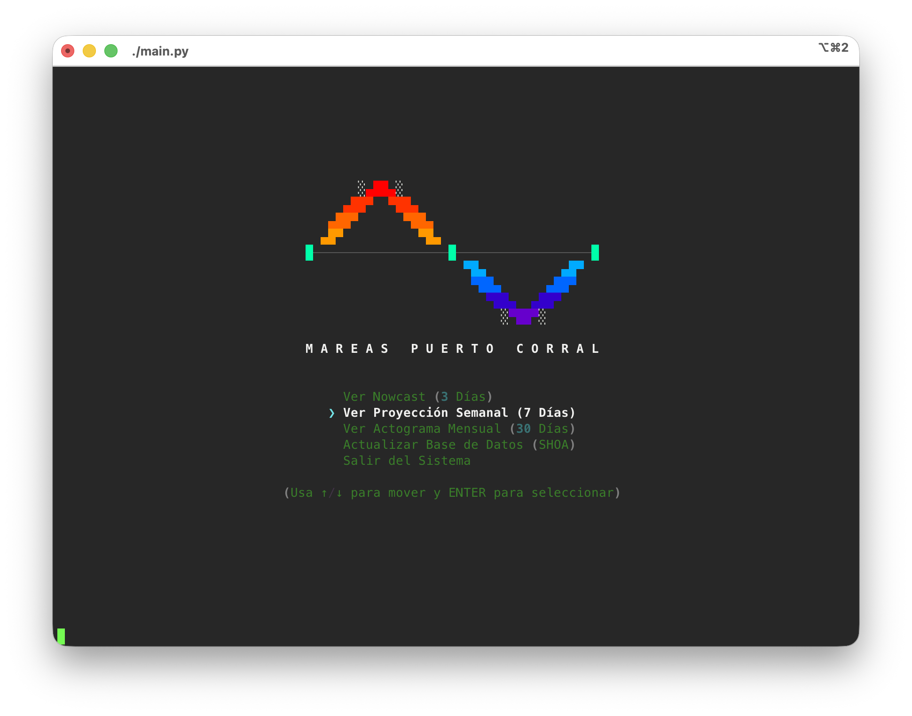
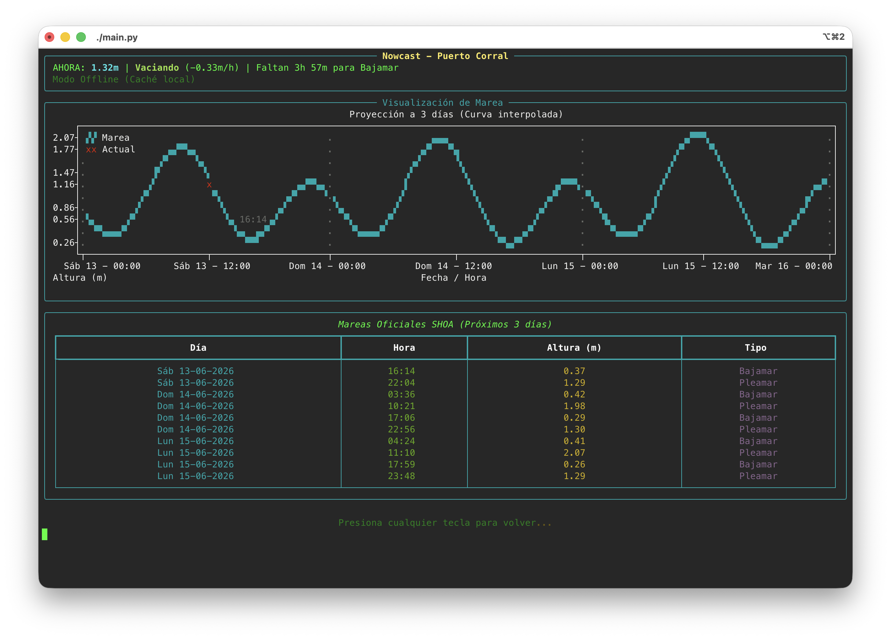
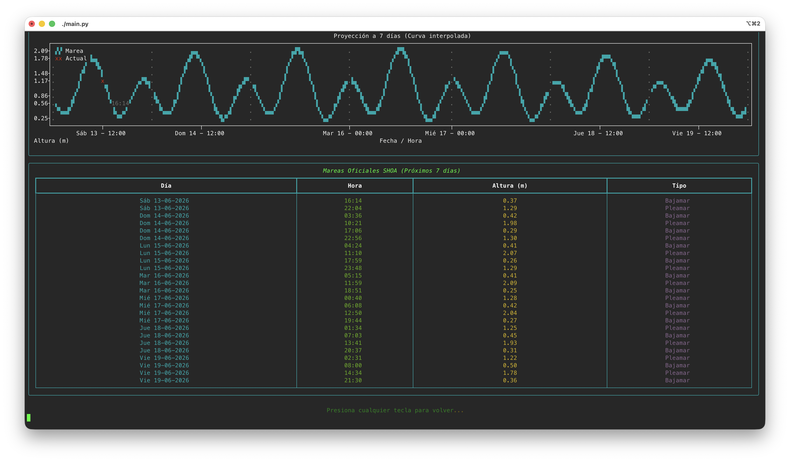
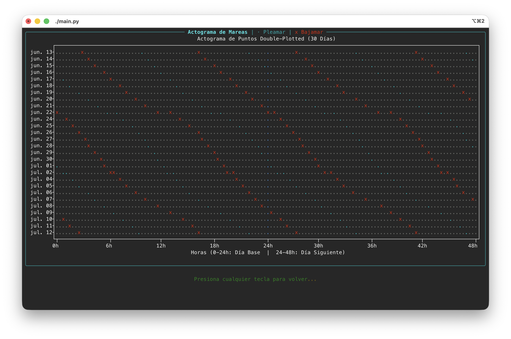

# Corral Tides CLI

Una Terminal User Interface (TUI) extremadamente minimalista con estética para visualizar, monitorear y analizar el comportamiento de las mareas en **Puerto Corral, Chile**, con énfasis en las mareas bajas.

Programado por interés personal para identificar la mejor hora de paseo en la playa de Curiñanco junto a mi familia y así encontrar (y rescatar) vida marina que haya quedado varada por la marea baja.

Este proyecto se conecta en vivo de manera invisible con el servicio del SHOA, extrae los datos limpios en segundo plano y despliega proyecciones locales utilizando interpolación cosenoidal a tramos. Toda la arquitectura funciona *offline-first* apoyándose en una memoria caché automática para no abusar del servidor.

## 🌊 Características

- **Nowcast (3 días)**: monitoreo a corto plazo mediante un ploteo continuo con indicadores flotantes de las próximas bajamares.
- **Proyección semanal (7 días)**: análisis extendido a 7 días y una tabla informativa formateada y codificada por colores.
- **Actograma mensual (30 días)**: una potente herramienta inspirada en la cronobiología (Double-Plotted Actogram) para trazar visualmente el corrimiento de la fase lunar a lo largo de 30 días, identificando el "drifting" (desfase) de pleamares y bajamares de manera totalmente orgánica.
- **Navegación interactiva por teclado**: menú manejado íntegramente con las flechas de dirección (`↑`, `↓`), con una estética minimalista profunda.
- **Diseño responsivo**: centrado automáticamente y con relajación geométrica, adaptable a cualquier tamaño de pantalla.

## 🖼 Screenshots

### Menú Principal Interactivo


### Nowcast de Mareas (3 Días)


### Proyección Semanal Extendida (7 Días)


### Actograma Mensual Cronobiológico (30 Días)


## ⚙️ Instalación

1. Clona el repositorio:
   ```bash
   git clone https://github.com/tu-usuario/nombre-del-repo.git
   cd nombre-del-repo
   ```

2. (Opcional pero recomendado) Crea un entorno virtual:
   ```bash
   python3 -m venv .venv
   source .venv/bin/activate
   ```

3. Instala las dependencias necesarias (`plotext`, `rich`, `requests`, `beautifulsoup4`):
   ```bash
   pip install -r requirements.txt
   ```

## 🚀 Uso

Ejecuta el menú principal. Si es la primera vez que lo corres, el programa contactará a SHOA y creará un archivo de caché inteligente en `~/.cache/mareas_corral.json`. 

```bash
./main.py
```

Utiliza las flechas del teclado y presiona `ENTER` para moverte a través del Nowcast, Proyecciones o actualizar los datos manualmente (el sistema se autoactualiza solo si los datos cumplen 1 año de antigüedad).

## 🛠 Arquitectura

- `/src/marea_3d.py`: Motor principal e interpolación matemática.
- `/src/marea_7d.py`: Motor extendido de la proyección semanal.
- `/src/marea_actograma.py`: Motor de gráficos de dispersión/cronobiológicos.
- `/main.py`: Menú principal responsivo y captura interactiva de teclado a bajo nivel (`tty`, `termios`).
